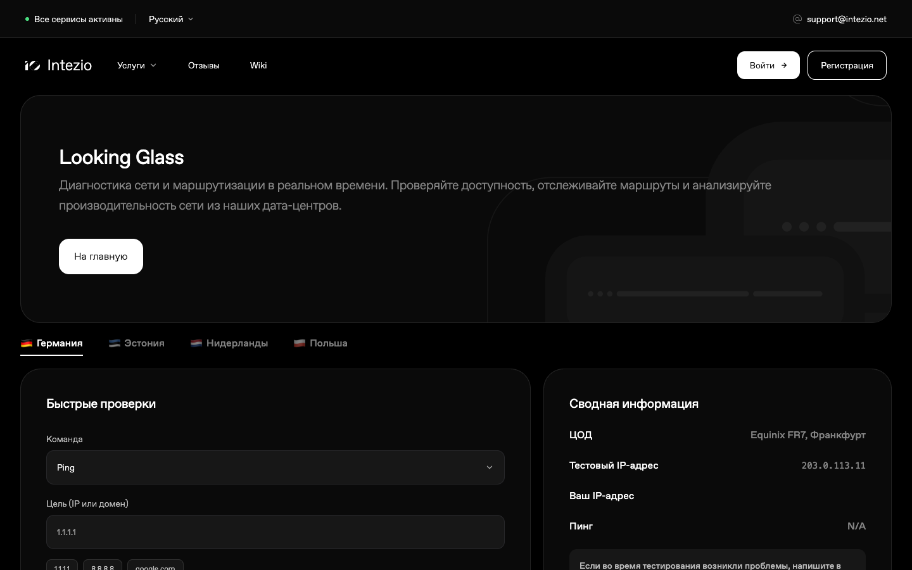
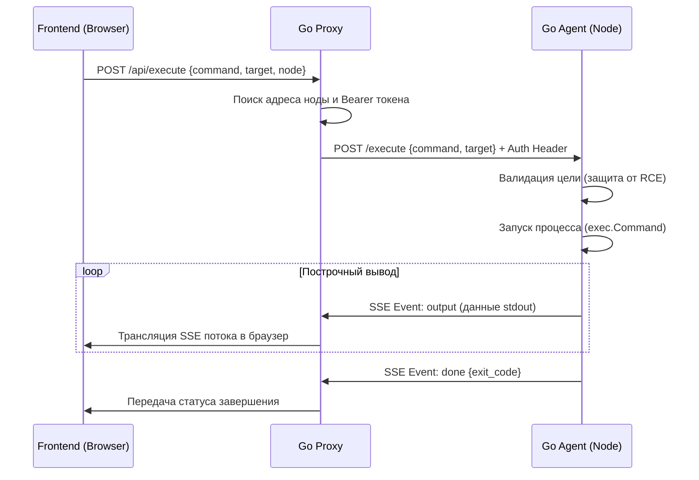

# Intezio Looking Glass (Leaked / Open Source)

[English version](README_EN.md)

Современный, высокопроизводительный и адаптивный Looking Glass инструмент для диагностики сети, маршрутизации и измерения пропускной способности каналов в реальном времени.



---

> [!WARNING]
> **Причина публикации (Слив)**
> Данный проект публикуется в открытый доступ (open-source) в связи с тем, что владелец хостинг-проектов **Intezio** и **1cent** (ИП Яковлев Денис Александрович) отказался оплачивать разработку данного инструмента Looking Glass, а также выполненную работу по технической поддержке пользователей. 
> Сурсы выкладываются «как есть» для блага сообщества.

---

## Архитектура и компоненты

Проект состоит из трех основных частей, спроектированных для работы в распределенной сети:

1. **Frontend (Vite + React + TypeScript)**:
   * Интерфейс в фирменном стиле с темной темой.
   * Полная поддержка интернационализации (i18n) — интерфейс переведен на **30 языков** (включая эсперанто, межславянский, латынь, казахский с мем-пасхалками и др.).
   * Измерение HTTP-RTT пинга с прогревом TCP/TLS соединений для минимизации погрешностей.
   * Плавные микро-анимации на базе `framer-motion`.

2. **Proxy (Go)**:
   * Координирует запросы от фронтенда к региональным нодам диагностики (агентам).
   * Проксирует Server-Sent Events (SSE) потоки вывода сетевых команд.
   * Отдает тестовые файлы разного объема для спидтестов (100MB, 1GB, 10GB).
   * Определяет IP-адрес клиента и управляет куками локализации.

3. **Agent (Go)**:
   * Устанавливается непосредственно на диагностические серверры в различных дата-центрах.
   * Безопасно запускает утилиты диагностики (`ping`, `traceroute`, `mtr`, `whois`) с валидацией входных аргументов для предотвращения RCE (Remote Code Execution) через инъекции shell-символов.
   * Включает встроенный сервер `iperf3` для замера пропускной способности.
   * Передает результаты выполнения команд клиенту в потоковом режиме через Server-Sent Events.

---

## Принцип работы и жизненный цикл запроса

Инструмент работает по распределенной схеме со стримингом данных в реальном времени:



### Шаги выполнения запроса:
1. **Инициация**: Пользователь вводит цель (IP или домен), выбирает команду (например, `ping`), диагностический сервер (например, Германия) и запускает проверку.
2. **Запрос к Прокси**: Фронтенд отправляет `POST`-запрос на единый прокси-сервер `/api/execute`. Прокси ищет в `NODES_CONFIG` настройки выбранной ноды, включая её внутренний/внешний URL и авторизационный токен (`AGENT_SECRET`).
3. **Запрос к Агенту**: Прокси совершает авторизованный `POST`-запрос к выбранному агенту с заголовком `Authorization: Bearer <secret>`.
4. **Валидация и безопасность**: Агент принимает запрос, проверяет цель на отсутствие спецсимволов командного интерпретатора (защита от инъекций команд и RCE) и валидирует её формат (IPv4 или FQDN-домен).
5. **Выполнение и стриминг (SSE)**: Агент запускает системную утилиту (например, `ping -c 4 -i 0.2 <цель>`) через `exec.Command`. Поток вывода (`stdout`) считывается построчно и мгновенно отправляется прокси-серверу в формате **Server-Sent Events (SSE)**.
6. **Отображение в UI**: Прокси транслирует этот чанковый поток в браузер без буферизации (`X-Accel-Buffering: no`). Фронтенд на лету дописывает строки в окно терминала, создавая эффект интерактивного вывода.
7. **Завершение**: Когда системная команда завершается, агент присылает событие `done` с кодом выхода процесса и закрывает стрим.

---

## Установка и запуск

### 1. Локальная разработка фронтенда
Убедитесь, что у вас установлен [Bun](https://bun.sh/).

```bash
# Установка зависимостей
bun install

# Запуск dev-сервера (фронтенд будет доступен на http://localhost:5173)
bun dev

# Сборка статики для продакшна
bun run build
```

### 2. Запуск Proxy
Для работы прокси требуются переменные окружения `PORT` и `NODES_CONFIG` (JSON-конфигурация нод).

```bash
cd proxy
export PORT=8080
export NODES_CONFIG='[{"id":"de","name":"Germany","url":"http://localhost:8081","secret":"your-agent-secret"}]'
go run main.go
```

### 3. Запуск Агента
Для запуска агента требуется утилиты диагностики в системе (`ping`, `traceroute`, `mtr`, `whois`, `iperf3`) и переменная `AGENT_SECRET`.

```bash
cd agent
export AGENT_PORT=8081
export AGENT_SECRET="your-agent-secret"
go run main.go
```

---

## Развертывание в Kubernetes

В директории `infra/k8s` находятся готовые шаблоны манифестов для развертывания проекта в кластере:
* `looking-glass.yaml` — деплоймент фронтенда и HPA.
* `proxy.yaml` — деплоймент прокси-сервера и секрет со списком нод.
* `agent-ingress.yaml` — настройки Ingress для маршрутизации запросов к агентам.
* `agent/` — манифесты агентов для деплоя на специфичные воркер-ноды с помощью `nodeSelector` (Германия, Эстония, Нидерланды, Польша).

---

## Лицензия (Non-Intezio Public License)

Код данного проекта распространяется на следующих условиях:

1. Разрешается бесплатное использование, копирование, изменение, объединение, публикация, распространение, сублицензирование и/или продажа копий данного программного обеспечения любыми лицами.
2. **Исключение**: Любое использование данного программного обеспечения (включая его части, измененные версии или производные продукты) **категорически запрещено** для:
   * Хостинг-проектов **Intezio** и **1cent** (включая Intezio Worldwide Limited, ИП Яковлев Денис Александрович, а также любые другие аффилированные бренды, проекты, дочерние структуры и юридические лица владельца).
3. Данное программное обеспечение предоставляется «как есть», без каких-либо гарантий.
