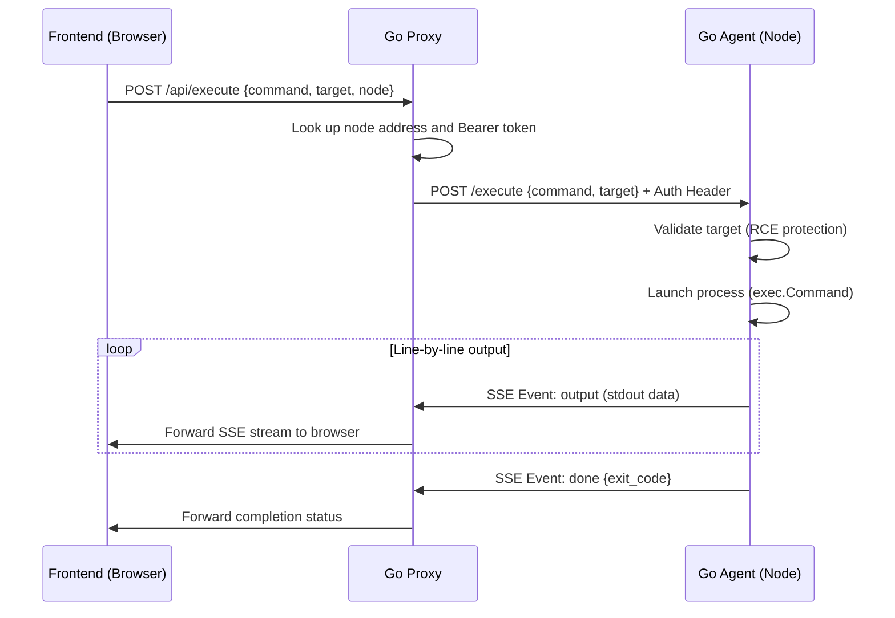

# Intezio Looking Glass (Leaked / Open Source)

A modern, high-performance, and adaptive Looking Glass tool for network diagnostics, routing analysis, and real-time bandwidth measurement.


---

> [!WARNING]
> **Reason for publication (Leak)**
> This project is being published as open-source because the owner of the **Intezio** and **1cent** hosting projects (IP Yakovlev Denis Alexandrovich) refused to pay for the development of this Looking Glass tool, as well as the completed user technical support work.
> The source code is released "as is" for the benefit of the community.

---

## Architecture and Components

The project consists of three main parts designed to work in a distributed network:

1. **Frontend (Vite + React + TypeScript)**:
   * Interface in the brand style with a dark theme.
   * Full internationalization (i18n) support — the interface is translated into **30 languages** (including Esperanto, Interslavic, Latin, Kazakh with meme Easter eggs, etc.).
   * HTTP-RTT ping measurement with TCP/TLS connection warm-up to minimize errors.
   * Smooth micro-animations based on `framer-motion`.

2. **Proxy (Go)**:
   * Coordinates requests from the frontend to regional diagnostic nodes (agents).
   * Proxies Server-Sent Events (SSE) streams of network command output.
   * Serves test files of various sizes for speed tests (100MB, 1GB, 10GB).
   * Detects client IP address and manages localization cookies.

3. **Agent (Go)**:
   * Installed directly on diagnostic servers in various data centers.
   * Securely runs diagnostic utilities (`ping`, `traceroute`, `mtr`, `whois`) with input argument validation to prevent RCE (Remote Code Execution) through shell character injection.
   * Includes a built-in `iperf3` server for bandwidth measurement.
   * Transmits command execution results to the client in streaming mode via Server-Sent Events.

---

## How It Works and Request Lifecycle

The tool operates on a distributed scheme with real-time data streaming:



### Request execution steps:
1. **Initiation**: The user enters a target (IP or domain), selects a command (e.g., `ping`), a diagnostic server (e.g., Germany), and starts the check.
2. **Request to Proxy**: The frontend sends a `POST` request to the single proxy server `/api/execute`. The proxy looks up the selected node's settings in `NODES_CONFIG`, including its internal/external URL and authorization token (`AGENT_SECRET`).
3. **Request to Agent**: The proxy makes an authorized `POST` request to the selected agent with the `Authorization: Bearer <secret>` header.
4. **Validation and Security**: The agent accepts the request, checks the target for shell special characters (protection against command injection and RCE), and validates its format (IPv4 or FQDN domain).
5. **Execution and Streaming (SSE)**: The agent launches a system utility (e.g., `ping -c 4 -i 0.2 <target>`) via `exec.Command`. The output stream (`stdout`) is read line by line and immediately sent to the proxy server in **Server-Sent Events (SSE)** format.
6. **UI Display**: The proxy forwards this chunked stream to the browser without buffering (`X-Accel-Buffering: no`). The frontend appends lines to the terminal window on the fly, creating an interactive output effect.
7. **Completion**: When the system command finishes, the agent sends a `done` event with the process exit code and closes the stream.

---

## Setup and Running

### 1. Local Frontend Development
Make sure you have [Bun](https://bun.sh/) installed.

```bash
# Install dependencies
bun install

# Start dev server (frontend will be available at http://localhost:5173)
bun dev

# Build static assets for production
bun run build
```

### 2. Running the Proxy
The proxy requires the environment variables `PORT` and `NODES_CONFIG` (JSON node configuration).

```bash
cd proxy
export PORT=8080
export NODES_CONFIG='[{"id":"de","name":"Germany","url":"http://localhost:8081","secret":"your-agent-secret"}]'
go run main.go
```

### 3. Running the Agent
The agent requires diagnostic utilities in the system (`ping`, `traceroute`, `mtr`, `whois`, `iperf3`) and the `AGENT_SECRET` environment variable.

```bash
cd agent
export AGENT_PORT=8081
export AGENT_SECRET="your-agent-secret"
go run main.go
```

---

## Kubernetes Deployment

The `infra/k8s` directory contains ready-to-use manifest templates for deploying the project in a cluster:
* `looking-glass.yaml` — frontend deployment and HPA.
* `proxy.yaml` — proxy server deployment and secret with the node list.
* `agent-ingress.yaml` — Ingress settings for routing requests to agents.
* `agent/` — agent manifests for deployment to specific worker nodes using `nodeSelector` (Germany, Estonia, Netherlands, Poland).

---

## License (Non-Intezio Public License)

The source code of this project is distributed under the following terms:

1. Free use, copying, modification, merging, publishing, distribution, sublicensing, and/or selling of copies of this software is permitted by any person.
2. **Exception**: Any use of this software (including its parts, modified versions, or derivative products) is **strictly prohibited** for:
   * Hosting projects **Intezio** and **1cent** (including Intezio Worldwide Limited, IP Yakovlev Denis Alexandrovich, as well as any other affiliated brands, projects, subsidiaries, and legal entities of the owner).
3. This software is provided "as is", without any warranties.
